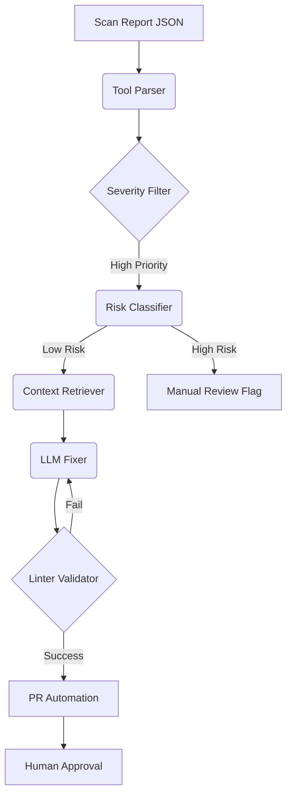

# PatchGuard CLI Usage Guide

PatchGuard is an autonomous security remediation agent that automates the process of fixing security vulnerabilities found by tools like SonarQube, Mend, and Trivy. This guide explains how to use the PatchGuard Command Line Interface (CLI).

---

## 🚀 Quick Start

To use the CLI, ensure you are in the project root and have the dependencies installed:

```bash
pip install -r requirements.txt
```

### Basic Commands

| Command | Description |
|:---|:---|
| `scan` | Parse a security report and list normalized findings. |
| `fix` | Generate and validate code fixes for found vulnerabilities. |

---

## 🔍 The `scan` Command

Analyze a security report JSON file and display the findings in a unified format.

### Syntax
```bash
python -m patchguard scan --tool {sonarqube,mend,trivy} --input <report_file> [--severity <levels...>]
```

### Arguments
- `--tool`: The source of the report. Must be `sonarqube`, `mend`, or `trivy`.
- `--input`: Path to the JSON scan report file.
- `--severity`: (Optional) Space-separated list of severity levels to include (e.g., `CRITICAL HIGH`). If omitted, tool-specific defaults are used.

### Example: Scanning a Trivy Report
```bash
python -m patchguard scan --tool trivy --input sample_trivy_scan.json --severity CRITICAL
```

---

## 🛠️ The `fix` Command

Automatically generate and validate code fixes for vulnerabilities found in a report.

### Syntax
```bash
python -m patchguard fix --tool {sonarqube,mend,trivy} --input <report_file> --repo <repo_path> [options]
```

### Arguments
- `--tool`: The source of the report (required).
- `--input`: Path to the JSON scan report file (required).
- `--repo`: Path to the local repository containing the source code to be fixed (required).
- `--severity`: (Optional) Space-separated list of severity levels to target (e.g., `CRITICAL HIGH`).
- `--provider`: (Optional) LLM provider to use (`openai`, `anthropic`, `gemini`, or `mock`). Default is `mock`.
- `--model`: (Optional) Specific model to use (e.g., `gpt-4o`, `claude-3-5-sonnet-20241022`, `gemini-2.5-flash`).
- `--api-key`: (Optional) LLM API key. If not provided, uses `OPENAI_API_KEY`, `ANTHROPIC_API_KEY`, or `GEMINI_API_KEY` environment variables.

### Example: Fixing SonarQube findings with GPT-4
```bash
python -m patchguard fix --tool sonarqube --input sonarqube_scan.json --repo ./src --provider openai --model gpt-4o
```

### Example: Fixing with Google Gemini
```bash
python -m patchguard fix --tool trivy --input trivy_scan.json --repo ./ --provider gemini --model gemini-2.5-flash
```

---

## 🔑 Configuring API Keys

PatchGuard requires access to an LLM provider to generate fixes. You can provide the API key in two ways:

### 1. Environment Variables (Recommended)
Set the appropriate environment variable in your shell:

**PowerShell:**
```powershell
$env:OPENAI_API_KEY = "sk-..."
$env:ANTHROPIC_API_KEY = "ant-..."
$env:GEMINI_API_KEY = "your-gemini-key..."
```

**Bash:**
```bash
export OPENAI_API_KEY="sk-..."
export ANTHROPIC_API_KEY="ant-..."
export GEMINI_API_KEY="your-gemini-key..."
```

### 2. CLI Argument
Pass the key directly using the `--api-key` flag:
```bash
python -m patchguard fix --tool trivy --input scan.json --repo ./ --provider openai --api-key "sk-..."
```

---

## 🧩 Default Severity Thresholds

If no `--severity` argument is provided, PatchGuard uses these secure defaults:

| Tool | Included Severities |
|:---|:---|
| **SonarQube** | `BLOCKER`, `CRITICAL` |
| **Mend (SCA)** | `CRITICAL`, `HIGH`, `MEDIUM`, `LOW` |
| **Trivy** | `CRITICAL`, `HIGH`, `MEDIUM` |

---

## 🔄 Remediation Workflow

PatchGuard follows a 5-step agentic loop for every vulnerability:



---

## 🧪 Testing with Mock Provider

You can safely test the pipeline without an LLM API key using the `mock` provider:

```bash
python -m patchguard fix --tool sonarqube --input sample_sonarqube_scan.json --repo ./ --provider mock
```

---

> [!TIP]
> Always review the generated fixes before merging. Use the automated Pull Requests created in Step 5 of the pipeline (Phase 9) for final human approval.

> [!IMPORTANT]
> Ensure your environment has the necessary project-specific linters installed (e.g., `flake8` for Python, `eslint` for JS) to allow PatchGuard to validate its fixes.
